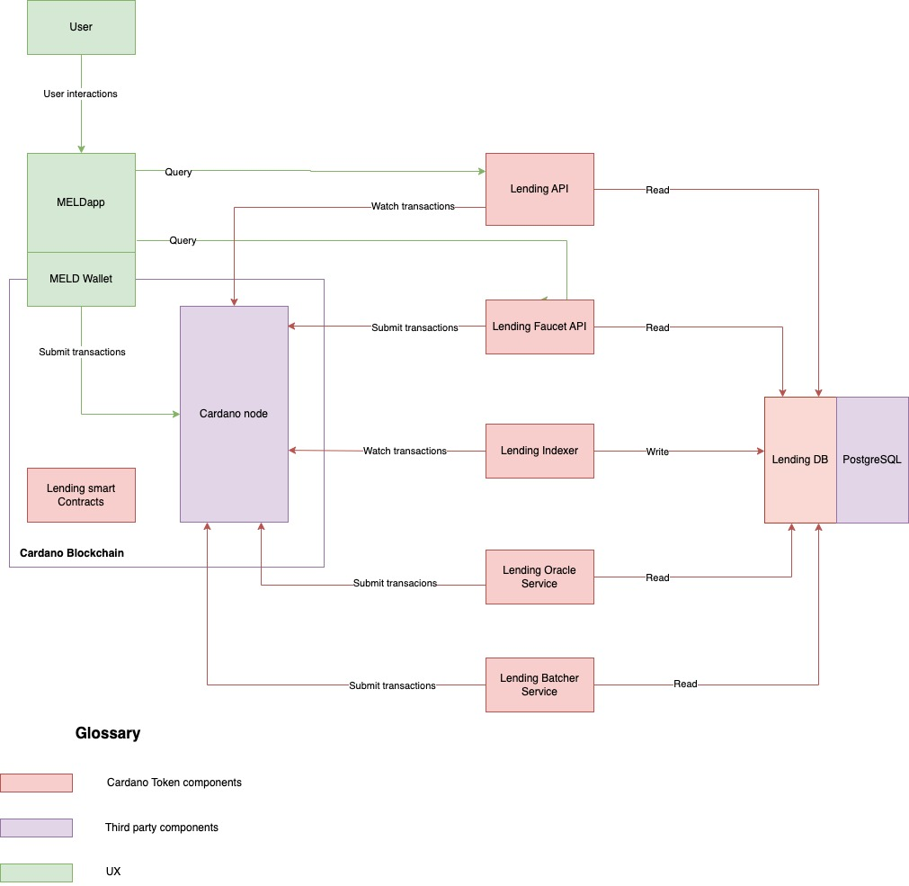

# MELD Lending and Borrowing protocol

This repository contains all smart contract implementations and off-chain services of MELD Lending and Borrowing protocol on the Cardano blockchain.

## Protocol architecture

The project include these following components:

### Lending smart contracts

We implement the Cardano smart contracts in Plutarch and build transactions with our `cardano-tx-builder` library.

### Lending DB

The Lending DB service in PostgreSQL is at the heart of all off-chain components.

The Lending Indexer sync protocol data from the
Cardano blockchain to Lending DB. Then other components can read serve data from the DB.

### Lending Indexer

The Lending Indexer sync the protocol data from the Cardano blockchain to Lending DB.

It is implemented using our in-house `cardano-index` framework. The connection constantly
streams events to our indexer whenever the node receives new blocks or detects a rollback. All data is persisted to a PostgreSQL DB in Lending DB.

### Lending API

The Lending API service serves data from the Lending DB for building transactions and UI rendering.

For now, the building transaction process is executed by the Lending API. We are also planning to move this process to front-end.

### Lending Oracle Service

The Lending Oracle Service provides the tokens' price on the blockchain that is needed for Lending and Borrowing smart contract execution.

It fetches the tokens' price from CoinMarketCap then builds and submits transactions to update the Oracle UTXO to the Cardano Blockchain.

The Lending Oracle Service is a temporary solution and third-party Oracle services will be integrated in the future.

### Lending Batcher Service

Our protocol uses the Concurrent & Deterministic Batching solution to avoid network congestion.

The Lending Batcher Service runs periodically to apply all users' requests to Pool.

### Lending Faucet API

The Lending Faucet API is a web-based service that provides test tokens for users on Preview and Preprod. It enables users to experiment with Lending and Borrowing testnet features, without having to spend real token on the mainnet.

## Main use cases

[The Main use cases document](https://github.com/MELD-labs/cardano-defi-public/blob/main/docs/update-account.md) describes how user interact with the Lending and Borrowing protocol.

## Smart contracts design

The detailed smart contracts design and transaction diagrams is available [here](https://github.com/MELD-labs/cardano-defi-public/blob/main/docs/transactions.md).

## Set up and run the project

The instruction to set up and run the project can be found [here](https://github.com/MELD-labs/cardano-defi-public/blob/main/docs/build.md).

## License

Distributed under the MIT License. See [LICENSE.md](https://github.com/MELD-labs/cardano-defi-public/blob/main/LICENSE.md) for more information.

## Getting help

To get support, please join the [MELD discord channel](https://discord.gg/melddefi).
