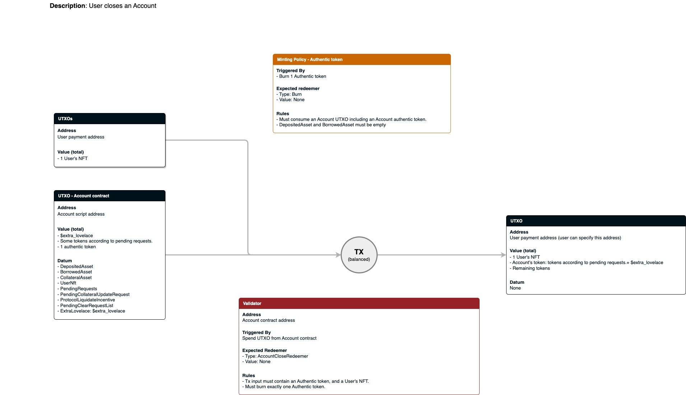

# Contracts design

Lending & Borrowing includes the following contracts:

## Account contract

- Store account's data. Each utxo corresponds to an account.
- Validate user's interaction with an account.

## Account authentic token minting policy

- Identify authentic account.

## Pool contract

- Store all protocol's lending & borrowing data and contain all available tokens.
- Validate applying user's requests.

## Manager contract

- Store all protocol parameters.

## Oracle contract

- Provide tokens' prices.

# Transaction diagrams

## Create account

## Update account

## Close account

## Liquidate

## Batching (Apply requests to Pool)

## Update Treasury

## update Oracle

## Update Manager

## Migrate Account

## Migrate Pool

