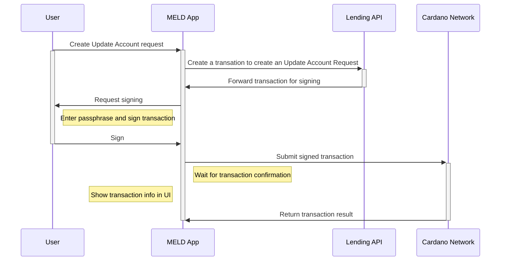
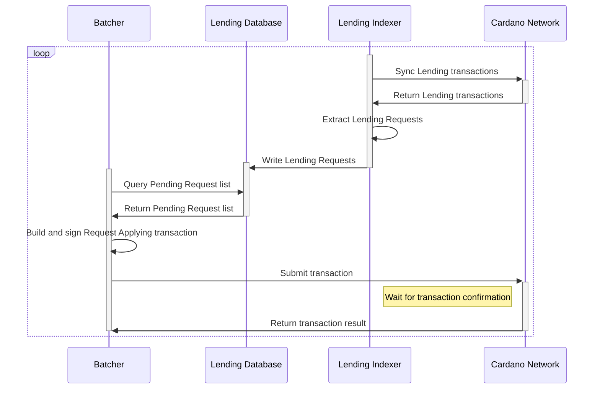
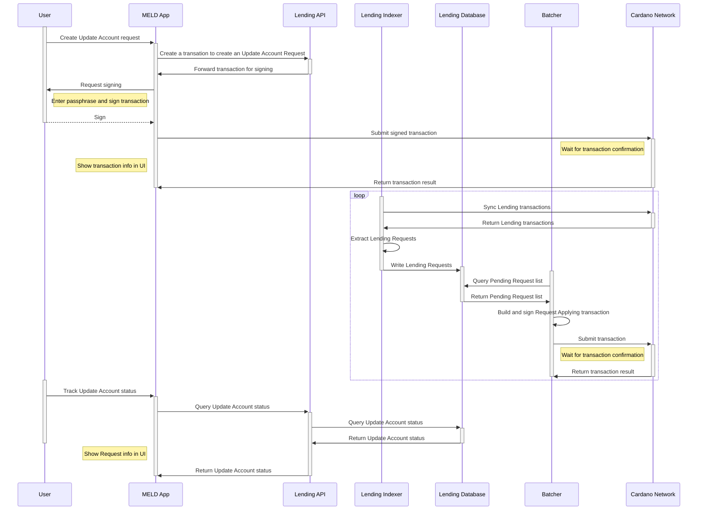

# Main use cases

This document describes the processing phase of user interactions with the Lending and Borrowing protocol.

## Use Case: Create Requests

**_Description:_**
Allows users to create Requests to Supply, Withdraw, Borrow, Repay tokens from the Lending Pool or Set Collateral tokens for the Account. The Requests will be applied after by a Batcher. After applying, the tokens will be transferred to the Lending Pool in Supply, Repay cases; paid back to users in Withdraw, Borrow cases; the collateral set of user's account will be updated in Set Collateral case.

**_Primary Actor_**:
User.

**_Secondary Actor:_**
MELD App, Lending API, Cardano Network.

**_Preconditions:_**
The User must have enough tokens for supplying, repaying, min ada utxo fee, batcher fee and transaction fee.

**_Main Success Scenario:_**

1. The User creates a request (Supply, Withdraw, Borrow, Repay, Set Collateral).
2. The Request is created using MELD App and sent to the Lending API.
3. The Lending API builds and returns the balanced unsigned transaction.
4. The User signs the transaction via MELDapp.
5. MELDapp submits the transaction to Blockchain.
6. The request is created and visible on Blockchain, waiting to be applied.

## Use Case: Applying Requests

**_Description:_**
Allows Batcher to apply all user Requests to the Lending Pool.

**_Primary Actor_**:
Batcher.

**_Secondary Actor:_**
Lending Database, Lending Indexer, Cardano Network.

**_Preconditions:_**
Anyone can be the Batcher. The Batcher must have enough tokens for the transaction fee.

**_Main Success Scenario:_**

1. The Lending Indexer watches the Lending transactions from Cardano Network.

2. The Lending Indexer extracts user Requests and writes to Lending Database.

3. The Batcher queries the Lending Database to get the pending Request list.

4. The Batcher builds then sign a transaction to apply pending Requests to the Pool, then signs and submits to Cardano Network.

5. The Batcher submits that transaction to Cardano Network, getting the transaction result.

## Request Cycle Full Flow

